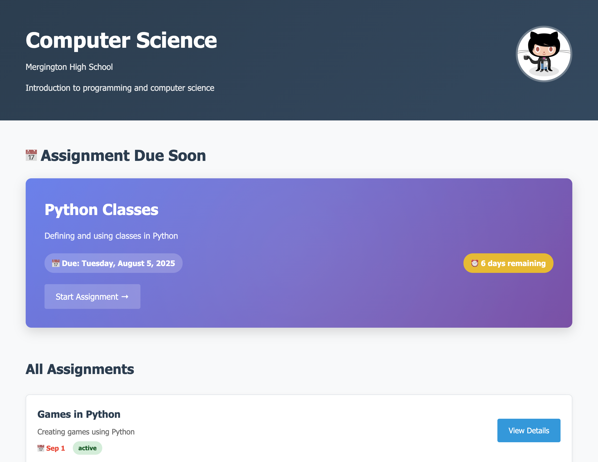
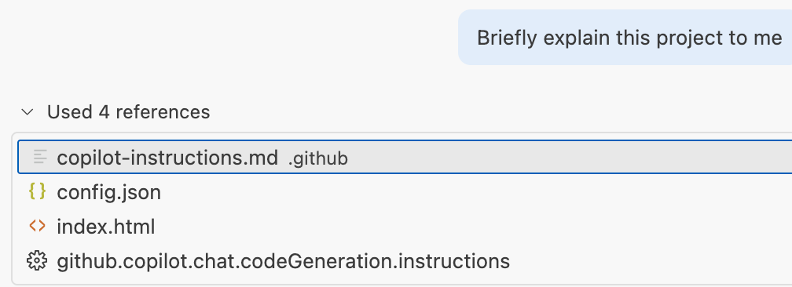

## Step 1: Setting Up Copilot Instructions

You're a teacher at Mergington High School who creates homework assignments and coding exercises for students. You maintain a static website to share these assignments and want to establish general standards for AI assistants to ensure consistent code quality and project structure.

You've heard Copilot Instructions can help with that!

<details>
<summary>Website screenshot 📸</summary><br/>

You will run this website in the first activity!



</details>

### 📖 Theory: What are repository custom instructions?

Repository custom instructions let you provide Copilot with repository-specific guidance and preferences that help it understand your project context and standards. By creating a `.github/copilot-instructions.md` file, you can ensure that Copilot's suggestions consistently follow your project conventions and coding standards.

The complete set of instructions will be automatically added to all requests that you submit to Copilot Chat in your repository.

> [!TIP]
> Keep instructions short and focused on the "how" of the project. This could be purpose, folder structure, coding standards, key tools, expected formats, etc.
> If you want similar instructions to work across multiple coding agents, also consider the open [`AGENTS.md`](https://agents.md/) format.

See the [GitHub Docs: Repository Custom Instructions](https://docs.github.com/en/copilot/how-tos/custom-instructions/adding-repository-custom-instructions-for-github-copilot) page for more information.

### ⌨️ Activity: Explore the Educational Website Project

To work with custom instructions, let's first set up our development environment and explore the project structure.

1. Clone this repository to your machine.

   [](vscode://vscode.git/clone?url=https://github.com/martinpolivka/skills-customize-your-github-copilot-experience.git)

   Or use the terminal:

   ```bash
   # Clone the prepared workshop repository and enter its folder.
   git clone https://github.com/martinpolivka/skills-customize-your-github-copilot-experience.git
   cd skills-customize-your-github-copilot-experience
   ```

1. Open the cloned repository in VS Code and wait for all extensions to install.
   - Ensure the **Live Preview** extension is activated.

1. Before making changes, create your own participant branch.

   ```bash
   # Create a participant branch for your lab work.
   git switch -c participant/<your-name>
   ```

1. Right-click on `index.html` and select **Show Preview** to see the website in action.

   > ❕ **Important**: Keep the preview tab open to see the live updates. We will be making edits throughout the exercise.

1. Explore the project structure:
   - Browse the `assets/` folder to see the website assets (CSS, JavaScript, images).
   - Look at the `assignments/` folder to understand the existing assignment formats.
   - Review `index.html` in the root directory to see the main website structure.
   - Review `config.json` in the root directory to see how the assignments are set up.

### ⌨️ Activity: Create Repository Copilot Instructions

Now that you've explored the project, let's create custom instructions to help Copilot understand your educational website project.

1. In VS Code, create a new file called:

   ```text
   .github/copilot-instructions.md
   ```

   > ❕ **Important:** Make sure the file name is correct. This specific filename is required for Copilot to recognize it.

1. Add the following content so Copilot understands the project's purpose, structure, and requirements:

   ```markdown
   # Project Description

   This project is an educational website for sharing homework assignments and coding exercises with students. Students can browse, view, and download assignments directly from the portal.

   ## Project Structure

   - [`assignments/`](../assignments/) Each homework assignment is stored in its own subfolder with a consistent structure.
   - [`templates/`](../templates/) Reusable templates for new content
   - [`assets/`](../assets/) Contains the website assets including CSS, JavaScript, images, and configuration files
   - [`index.html`](../index.html) The main website page that serves as a static portal for browsing and viewing assignments. Content is configurable via [`config.json`](../config.json) file to dynamically generate assignment lists and details.

   ## Project Guidelines

   - Maintain consistent styling across all pages
   - Keep file and folder names descriptive and organized

   ## Educational Standards

   When generating content for this project:

   - **Learning-focused**: All content should be designed with clear learning objectives and appropriate difficulty levels
   - **Student-friendly**: Use clear, encouraging language that motivates students
   ```

1. Test your instructions by asking Copilot about the project:

   > 
   >
   > ```prompt
   > Briefly explain this project to me
   > ```

1. Notice that Copilot uses your custom instructions as a reference in the response.

   

1. Commit the `.github/copilot-instructions.md` file to your `participant/<your-name>` branch and push it to GitHub.

<details>
<summary>Having trouble? 🤷</summary><br/>

- The `.github/copilot-instructions.md` file should be at the root of the `.github` folder
- Make sure you committed and pushed the changes.

</details>

---

### Navigation

- [Back to README](../../README.md)
- Next: [Step 2](2-step.md)
